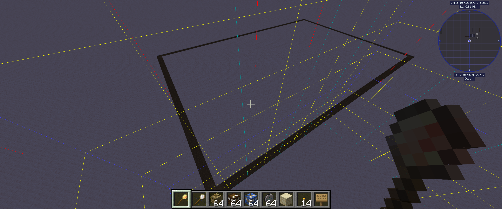
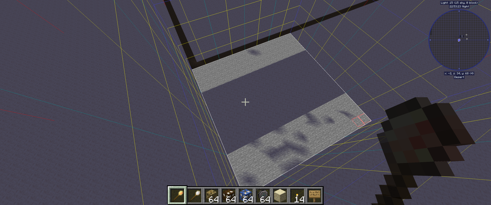
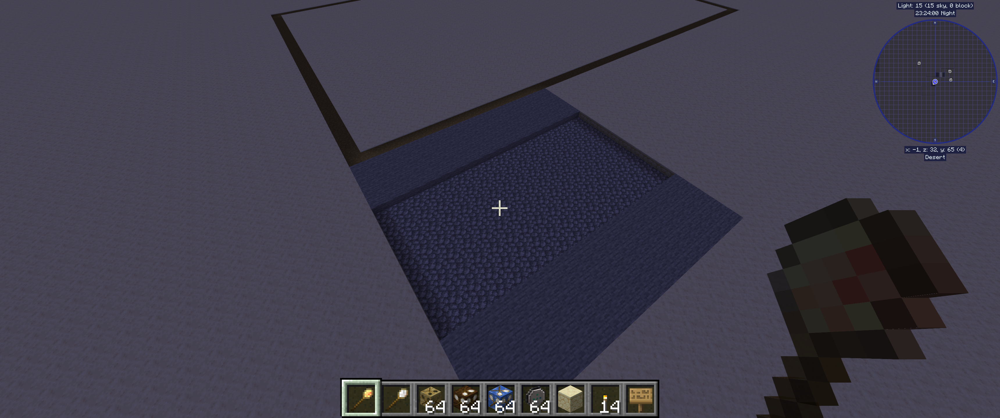
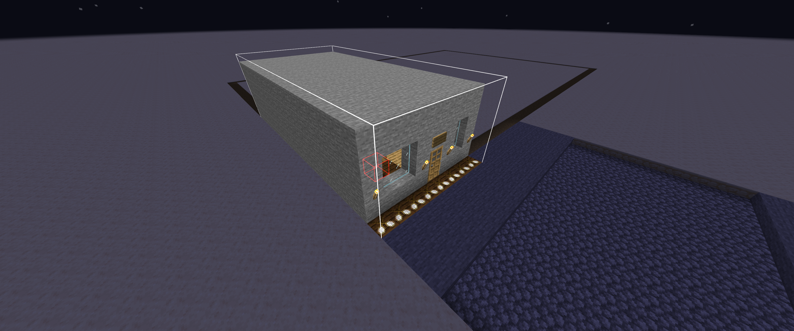
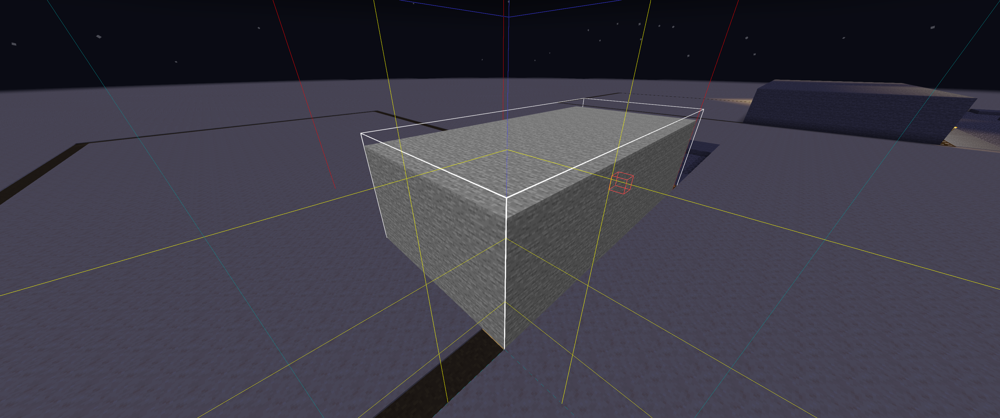
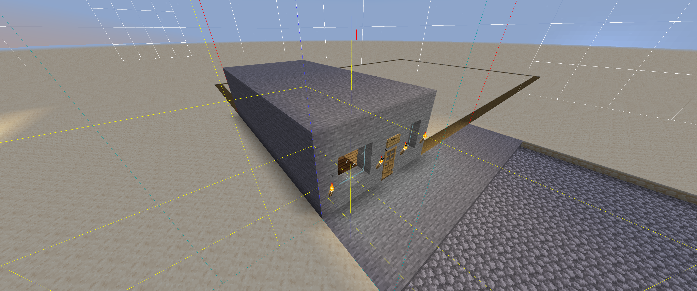

# Metro build style
An urban-themed build style for Minecolonies/Structurize, inspired by New York City.

## Description
Metro is meant to replicate the look and layout of a city, using New York City as an inspiration. Parts are built to fit within a chunk (or a portion of a chunk) and to fit together. It's recommended to show chunk outlines with `F3+G` while placing structures with the Metro style for ease of lining them up.

Buildings are built on 2x3-chunk city blocks, with 1-chunk streets connecting them. Streets consist of two sidewalks with the "street" section in-between, and come in straight, corner, t-intersection, and intersection versions. Schematics are built at first with primitive materials like wood and (cobble)stone. Most buildings start at level 1 as single-story buildings, and add additional floors with each level they are upgraded to. They will also take on a more sophisticated, modern look with each upgrade.

## How to use Metro components
* Activate the grid overlay using `F3+G`
* The `Planning` folder includes a "city block" piece that creates a 2x3 chunk outline, which may help you plan the layout of your city.
* When placing ROADS, ensure the entire road piece fits within a single chunk. The actual "road" will be slightly sunken compared to the "sidewalk" portion of the component.
* When placing BUILDINGS, ensure the entirety of the building fits within the chunk, EXCEPT for the front of the building. It will consist of brown placeholder blocks and should go just past the edge of the chunk.
  * Note that some buildings are not a full chunk in size; ensure these buildings are placed against the side of a chunk so that buildings will fit together perfectly.

## Tutorial

First, let's place down a `cityblock` under the `Planning` folder. Align it with the chunk borders to create a 2x3 city block area. Once complete, a dirt path will outline the edges of the city block.  

Next, let's place down a straight road. This can be found under the `Infrastructure/Roads` folders. Using the grid overlay, we can place the street parallel to the city block, ensuring the sidewalk is flush with the ground.  

Finally, let's put down a Builder's Hut. Grab it from the `Huts` folder. The front of the hut BUILDING should be on the edge of the city block border, with the brown placeholder portion of the building extending just beyond the city block. If done correctly, the hut will be constructed within the city block, and flush against the sidewalk.   

## Installation
To install the Metro build style, copy the included `blueprints` folder into your modded Minecraft root folder. There should be an existing `blueprints` folder there. Metro build components will then appear alongside other sets when using the build tool.

## Contributing
If you'd like to contribute to the Metro project, please fork the repo, make a new branch in the forked repo with your changes, and open a pull request targeted at the main repo's `main` branch.
